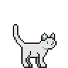
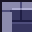
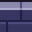
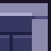
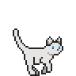
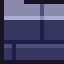
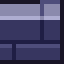

# cat heist 🐾

> _a community maze game. help the cat steal the loot._

**maze #1 — Mochi**
2 moves so far

---

## the maze

<table><tbody>
<tr>
<td></td>
<td></td>
<td></td>
<td></td>
<td></td>
<td></td>
<td></td>
<td></td>
<td></td>
<td></td>
<td></td>
</tr>
<tr>
<td></td>
<td></td>
<td></td>
<td></td>
<td></td>
<td></td>
<td></td>
<td></td>
<td></td>
<td></td>
<td></td>
</tr>
<tr>
<td></td>
<td></td>
<td></td>
<td></td>
<td></td>
<td></td>
<td></td>
<td></td>
<td></td>
<td></td>
<td></td>
</tr>
<tr>
<td></td>
<td></td>
<td></td>
<td></td>
<td></td>
<td></td>
<td></td>
<td></td>
<td></td>
<td></td>
<td></td>
</tr>
<tr>
<td></td>
<td></td>
<td></td>
<td></td>
<td></td>
<td></td>
<td></td>
<td></td>
<td></td>
<td></td>
<td></td>
</tr>
<tr>
<td></td>
<td></td>
<td></td>
<td></td>
<td></td>
<td></td>
<td></td>
<td></td>
<td></td>
<td></td>
<td></td>
</tr>
<tr>
<td></td>
<td></td>
<td></td>
<td></td>
<td></td>
<td></td>
<td></td>
<td></td>
<td></td>
<td></td>
<td></td>
</tr>
<tr>
<td></td>
<td></td>
<td></td>
<td></td>
<td></td>
<td></td>
<td></td>
<td></td>
<td></td>
<td></td>
<td></td>
</tr>
<tr>
<td></td>
<td></td>
<td></td>
<td></td>
<td></td>
<td></td>
<td></td>
<td></td>
<td></td>
<td></td>
<td></td>
</tr>
<tr>
<td></td>
<td></td>
<td></td>
<td></td>
<td></td>
<td></td>
<td></td>
<td></td>
<td></td>
<td></td>
<td></td>
</tr>
<tr>
<td></td>
<td></td>
<td></td>
<td></td>
<td></td>
<td></td>
<td></td>
<td></td>
<td></td>
<td></td>
<td></td>
</tr>
</tbody></table>

<a href="https://github.com/chilli-garlic-momo/chilli-garlic-momo/issues/new?title=Move%3A+UP">⬆️</a>&nbsp;&nbsp;<a href="https://github.com/chilli-garlic-momo/chilli-garlic-momo/issues/new?title=Move%3A+DOWN">⬇️</a>&nbsp;&nbsp;<a href="https://github.com/chilli-garlic-momo/chilli-garlic-momo/issues/new?title=Move%3A+LEFT">⬅️</a>&nbsp;&nbsp;<a href="https://github.com/chilli-garlic-momo/chilli-garlic-momo/issues/new?title=Move%3A+RIGHT">➡️</a>

_click a direction · a pre-filled issue opens · just hit submit_
_one move per person every 15 minutes_

---

## how it works

- click a direction above → a github issue opens, pre-filled
- submit the issue → an action runs, moves the cat, updates this board
- reach the 🚪 exit to complete the maze and **adopt Mochi**
- the winner's handle is immortalised in the hall of fame below
- one move per person every 15 minutes — others can still move

---

## hall of fame

_no completed mazes yet. be the first to adopt a cat!_

---

_built with github actions · [source](scripts/update_maze.py)_

