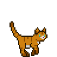

# cat heist 🐾 

_a community maze game — help **Nori** find the exit_

**total moves made by Nori in maze #2: 4** · last move by [@Preksha-Chaki](https://github.com/Preksha-Chaki)

<a href="https://github.com/chilli-garlic-momo/chilli-garlic-momo/issues/new?title=Move%3A+UP">⬆️</a>&nbsp;&nbsp;<a href="https://github.com/chilli-garlic-momo/chilli-garlic-momo/issues/new?title=Move%3A+DOWN">⬇️</a>&nbsp;&nbsp;<a href="https://github.com/chilli-garlic-momo/chilli-garlic-momo/issues/new?title=Move%3A+LEFT">⬅️</a>&nbsp;&nbsp;<a href="https://github.com/chilli-garlic-momo/chilli-garlic-momo/issues/new?title=Move%3A+RIGHT">➡️</a>

_click a direction · a pre-filled issue opens · hit submit · one move per person every 15 min_

---

<b>how it works</b>

- click a direction above → a github issue opens, pre-filled — just submit it
- a github action runs, moves the cat, re-renders this board
- reach the door to complete the maze and **adopt Nori**
- winners are immortalised in the hall of fame
- one move per person every 15 minutes — others can still move

## hall of fame

| # | cat | adopted by | moves |
|---|-----|------------|-------|
| 1 | Mochi | [@rootmnt](https://github.com/rootmnt) | 18 |

_built with github actions · [source](scripts/update_maze.py)_

